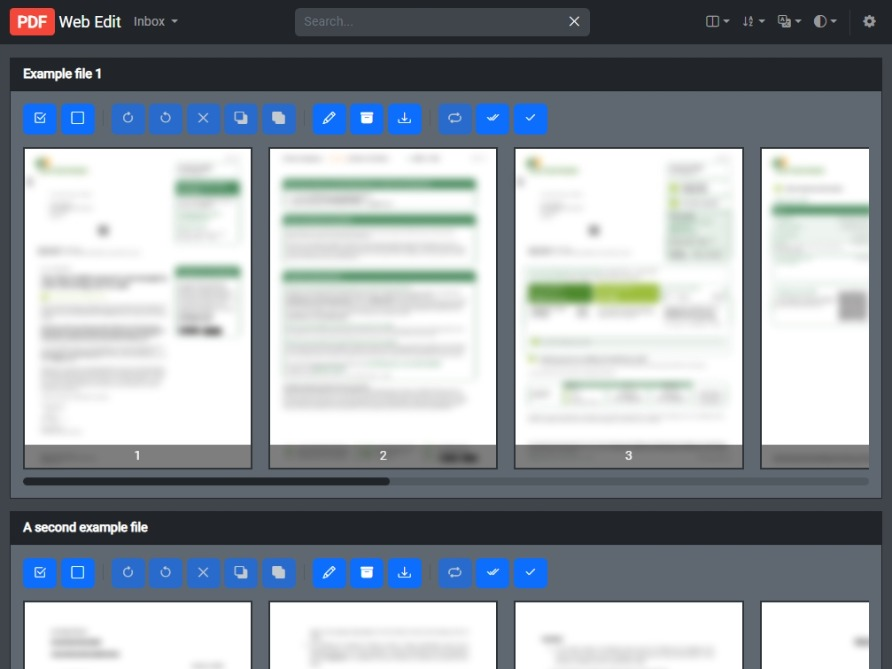

## PDF Web Edit
PDF Web Edit is a web-based application for manipulating PDF files. It's main purpose is to pre-process documents before they are imported into a Document Management System (DMS) such as [Paperless](https://github.com/the-paperless-project/paperless) ([-ng](https://github.com/jonaswinkler/paperless-ng) and [-ngx](https://github.com/paperless-ngx/paperless-ngx)) or stored in a directory based strucutre.

## :rocket: Features
:heavy_check_mark: List all PDF documents in a directory  
:heavy_check_mark: Search by document names  
:heavy_check_mark: Sort by name, creation and modified date  
:heavy_check_mark: Preview pages  
:heavy_check_mark: Delete pages  
:heavy_check_mark: Rotate pages  
:heavy_check_mark: Reorder pages  
:heavy_check_mark: Split pages  
:heavy_check_mark: Merge pages  
:heavy_check_mark: Multi-select for quick manipulation  
:heavy_check_mark: Delete document  
:heavy_check_mark: Unlock encrypted/password protected documents  
:heavy_check_mark: Move documents to outbox directory  
:heavy_check_mark: Multilingual support  
:heavy_check_mark: Dark mode

### :hammer: Built With


### :camera: Screenshots
Light | Dark
--- | ---
 | 

## :vertical_traffic_light: Getting Started
The application works on the assumption that all your documents are pushed into an inbox folder ready for processing. Documents could come from a variety of sources such as a network scanner or another tool doing other pre-processing (e.g. OCR).

The user can then process those files through the web-based user interface. You can manipulate a file (e.g. rotate a page, remove blank pages or reorder pages) before saving, or deleting the document. Any modifications that you make are copied into an edited version of the original document (thus not making any changes to the original). This allows us to undo/restore the original document if a page is accidentally removed or file corruption occurs.

Saving the document will move the file from the inbox folder into the outbox folder. Whilst deleting a document will move it into the archive folder (this behaviour is configurable in the conf.json file if you would prefer to permanently delete the file rather than move it to the archive directory).

## :file_folder: Important Paths

1. Inbox - Directory where files are put ready to be processed.
2. Outbox - Directory where files are moved to after the user presses save.
3. Archive - Directory where files that are deleted are moved to.
4. Config - Directory where the conf.json file of user configuration options is stored.

## :arrow_forward: Running the Application
Whilst you could build this project and drop the files into an IIS application, the simplest method is using Docker.

### :whale2: Docker

1. Pull the image:
```
docker pull lbrowning/pdf-web-edit
```
2. Run a container (replacing the host paths with your desired paths): 
    
```
docker run -p 10000:80 -v /host/config:/config -v /host/inbox:/inbox -v /host/outbox:/outbox -v /host/archive:/archive lbrowning/pdf-web-edit:latest
```

Congratulations, PDF Web Edit should now be running on port 10000!

### :wrench: Configuration
A configuration file named conf.json is created in the Config directory on first launch. This file can be modified by the user to change any settings. 

**Please note: the application must be restarted for any changes to take affect!**

## :computer: Development
PDF Web Edit has been developed using Visual Studio. If you would like to run the project yourself follow these simple steps;

### :bell: Prerequisites
- Node.js (I'm using v14.15.4 currently)
- Visual Studio 2022

### :bug: Run the code
1. Download the code.
2. Open the solution in Visual Studio.
3. Edit the appsettings.Development.json to use your local paths.
4. Restore nuget packages and node modules.
5. Press Run!

Optionally, to build your own Docker image, make sure you have Docker Desktop installed, then right click on the Dockerfile in Visual Studio and click `Build Docker Image`.

## :information_desk_person: Contributions
Contributions are very welcome! Please feel free to to fork the repository and create a pull request for any new features. Alternatively, you can also open a [discussion](https://github.com/luke-browning/pdf-web-edit/discussions) if you would like to discuss anything to do with the project. Feature requests are also encouraged so the community can vote on the best ideas.

## :heart: 3rd Party Libraries
The project uses a number of 3rd party libraries for manipulating the PDF documents;

1. [iText 7](https://github.com/itext/itext7-dotnet) - iText 7 is used to remove, rotate and reorder pages.
2. [docnet](https://github.com/GowenGit/docnet) - docnet is used to generate previews of the pages in a document using [PDFium](https://pdfium.googlesource.com/pdfium/).
